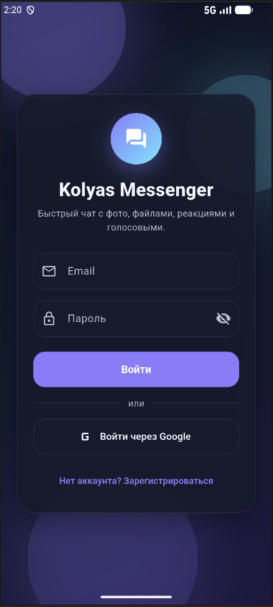
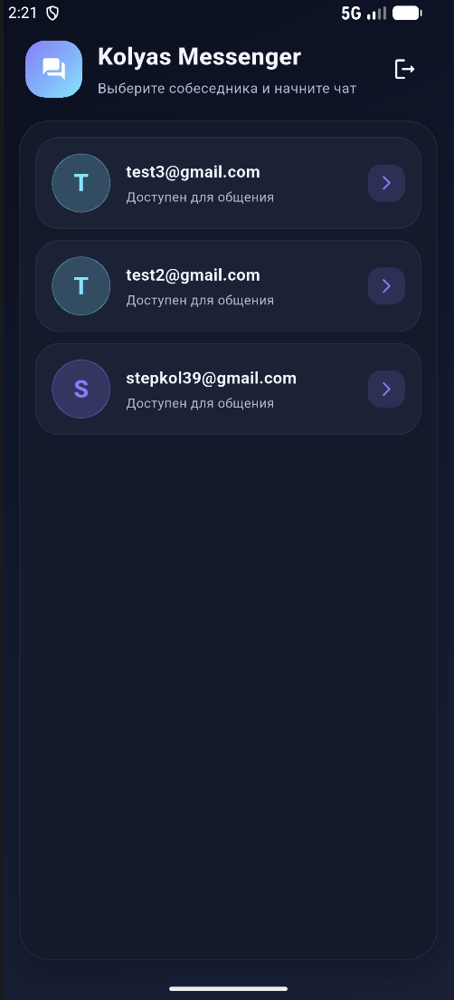
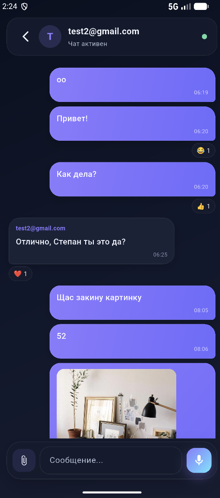
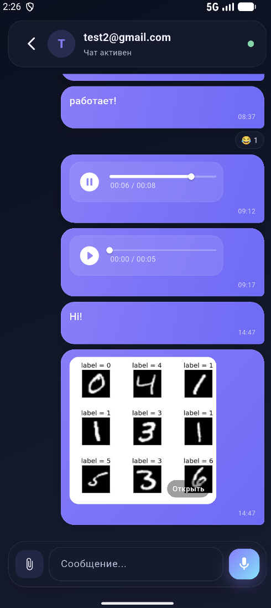
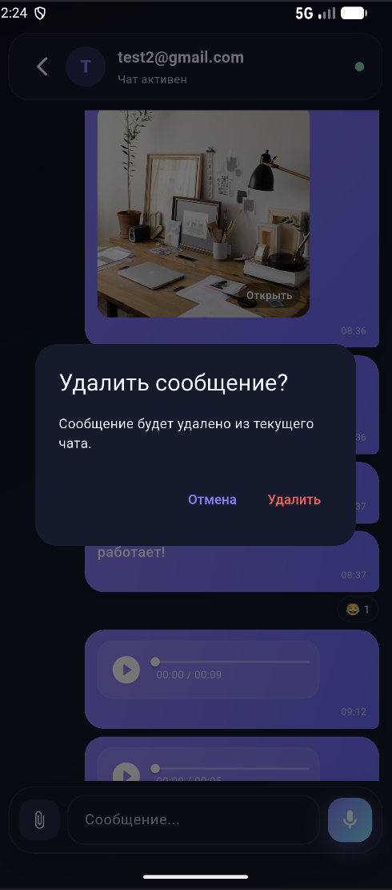
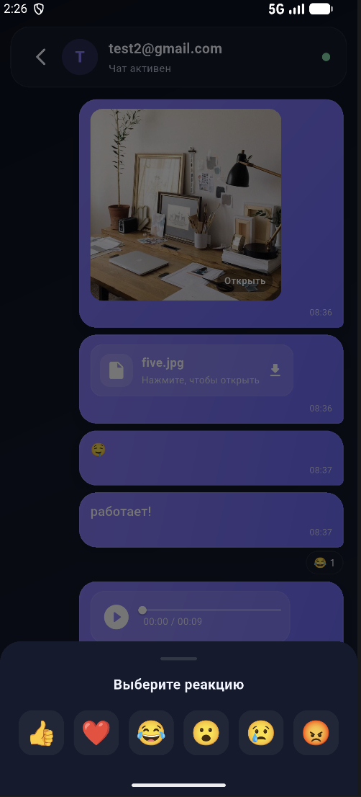
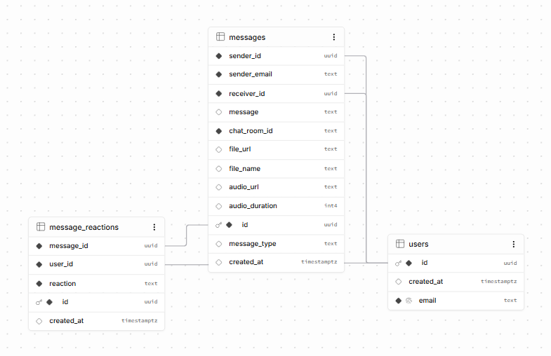
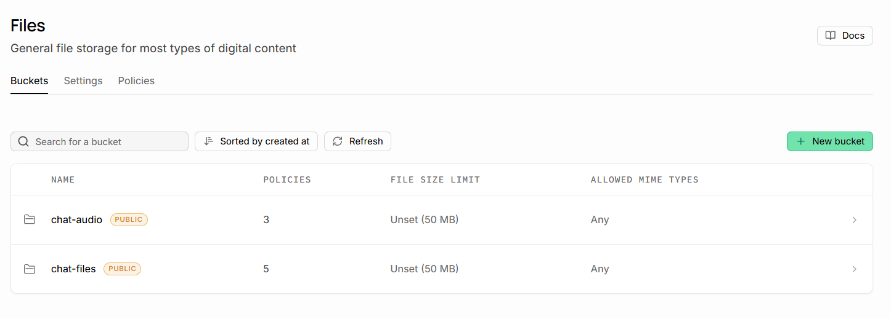

<div align="center">


# Kolyas Client-Server Messenger

### Клиент-серверное Flutter-приложение для обмена сообщениями через Supabase


</div>

---

## О проекте

**Kolyas Client-Server Messenger** — клиент-серверное мобильное приложение-мессенджер, разработанное на **Flutter** в рамках практической работы №6 по предмету **«Основы разработки мобильных приложений»**.

Проект показывает, как мобильное приложение работает не только локально, а взаимодействует с серверной частью: авторизацией, базой данных, realtime-обновлениями и облачным хранилищем файлов.

В качестве backend-платформы используется **Supabase**:

- **Supabase Auth** — регистрация, вход по email/паролю и Google OAuth;
- **Supabase Database / PostgreSQL** — хранение пользователей, сообщений и реакций;
- **Supabase Realtime** — получение новых сообщений и реакций в реальном времени;
- **Supabase Storage** — хранение изображений, файлов и голосовых сообщений.

---

## Скриншоты приложения

<div align="center">
<table>
  <tr>
    <td align="center">
      <br>
      <b>Вход в приложение</b>
    </td>
    <td align="center">
      <br>
      <b>Экран после входа</b>
    </td>
    <td align="center">
      <br>
      <b>Чат с собеседником</b>
    </td>
  </tr>
  <tr>
    <td align="center">
      <br>
      <b>Голосовые, картинки и файлы</b>
    </td>
    <td align="center">
      <br>
      <b>Удаление сообщения</b>
    </td>
    <td align="center">
      <br>
      <b>Реакции на сообщения</b>
    </td>
  </tr>
</table>
</div>

---

## Что умеет приложение

- регистрация нового пользователя по email и паролю;
- вход в аккаунт по email и паролю;
- вход через Google OAuth;
- автоматическое создание/обновление профиля пользователя в таблице `users`;
- отображение списка собеседников;
- открытие личного чата между двумя пользователями;
- отправка текстовых сообщений;
- отправка изображений из галереи;
- отправка файлов;
- запись и отправка голосовых сообщений;
- воспроизведение голосовых сообщений внутри чата;
- просмотр изображений на отдельном экране;
- сохранение изображений в галерею;
- удаление сообщения;
- удаление сообщения вместе с файлом из Storage;
- добавление emoji-реакции на сообщение;
- обновление чата и реакций в реальном времени.

---

## Как работает backend в Supabase

В этой работе Supabase выполняет роль серверной части приложения. Flutter-клиент не хранит сообщения только у себя на устройстве, а отправляет данные в облачную базу данных и получает обновления обратно через realtime-подписки.

### 1. База данных

<div align="center">
  <br>
  <b>Схема базы данных Supabase</b>
</div>

В базе данных используются три основные таблицы:

| Таблица | Для чего нужна |
|---|---|
| `users` | хранит пользователей приложения: `id`, `email`, `created_at` |
| `messages` | хранит сообщения: отправитель, получатель, текст, тип сообщения, ссылки на файлы/аудио, время создания |
| `message_reactions` | хранит реакции пользователей на сообщения |

Связи построены через UUID:

- `messages.sender_id` связан с `users.id`;
- `messages.receiver_id` связан с `users.id`;
- `message_reactions.message_id` связан с `messages.id`;
- `message_reactions.user_id` связан с `users.id`.

У таблицы `message_reactions` есть ограничение `UNIQUE(message_id, user_id)`, поэтому один пользователь может поставить только одну реакцию на одно сообщение. Если он выбирает другую реакцию, она обновляется.

---

### 2. Realtime

Для таблиц `messages`, `users` и `message_reactions` включается публикация Supabase Realtime. Благодаря этому приложение может подписываться на изменения в базе:

```text
пользователь отправил сообщение → запись появилась в messages → Supabase отправил событие → чат обновился
```

В коде это реализовано через подписки на изменения PostgreSQL-таблиц. Новые сообщения добавляются в список без ручного обновления экрана.

---

### 3. Row Level Security

В Supabase включается **RLS** — Row Level Security. Это ограничивает доступ к данным на уровне строк таблицы.

Простыми словами:

- пользователь видит только сообщения, где он отправитель или получатель;
- отправить сообщение можно только от своего `auth.uid()`;
- удалить своё сообщение может отправитель;
- реакции можно добавлять, изменять и удалять только от своего пользователя.

Это важно, потому что даже если кто-то попробует обратиться к базе напрямую, правила доступа будут проверяться на стороне Supabase.

---

### 4. Хранилище файлов

<div align="center">
  <br>
  <b>Supabase Storage: buckets для файлов и аудио</b>
</div>

Для файлов используются два bucket-хранилища:

| Bucket | Что хранит |
|---|---|
| `chat-files` | изображения и обычные файлы |
| `chat-audio` | голосовые сообщения |

При отправке файла приложение сначала загружает его в Supabase Storage, получает публичный URL, а затем создаёт запись в таблице `messages`.

```text
Файл на телефоне → upload в Storage → public URL → запись в messages → сообщение видно в чате
```

При удалении файлового или голосового сообщения приложение удаляет не только запись из таблицы `messages`, но и сам файл из `chat-files` или `chat-audio`.

---

## Настройка Supabase с нуля

### 1. Создать проект Supabase

1. Откройте Supabase Dashboard.
2. Создайте новый проект.
3. Дождитесь создания базы данных.
4. Перейдите в **Project Settings → API**.
5. Скопируйте:
   - `Project URL`;
   - `anon public` key.

Эти значения нужно указать в файле:

```text
app/lib/supabase_options.dart
```

Пример структуры файла:

```dart
class SupabaseOptions {
  static const String supabaseUrl = 'YOUR_SUPABASE_PROJECT_URL';
  static const String supabaseAnonKey = 'YOUR_SUPABASE_ANON_KEY';

  static const String filesBucket = 'chat-files';
  static const String audioBucket = 'chat-audio';

  static const String googleRedirectUri =
      'io.supabase.flutterquickstart://login-callback';
}
```

> В репозиторий лучше не выкладывать личные служебные ключи. `anon public` используется в клиентских приложениях, но для своего проекта всё равно лучше заменить его на собственный.

---

### 2. Создать таблицы, индексы, RLS и Storage

В репозитории есть готовый SQL-файл:

```text
docs/sql/supabase_setup.sql
```

Откройте в Supabase:

```text
SQL Editor → New query
```

Вставьте содержимое файла `docs/sql/supabase_setup.sql` и выполните запрос.

Скрипт создаёт:

- таблицу `users`;
- таблицу `messages`;
- таблицу `message_reactions`;
- индексы для быстрых запросов;
- Realtime-публикации;
- RLS-политики;
- Storage buckets `chat-files` и `chat-audio`;
- политики доступа к файлам.

---

### 3. Включить Auth по email/паролю

В Supabase откройте:

```text
Authentication → Providers → Email
```

Проверьте, что email provider включён. Для учебного проекта можно отключить обязательное подтверждение email, чтобы регистрация сразу работала в приложении.

---

### 4. Настроить вход через Google

Для Google-входа нужно связать Google Cloud и Supabase.

Общий порядок:

1. В Google Cloud Console создать OAuth Client.
2. В Supabase открыть **Authentication → Providers → Google**.
3. Вставить `Client ID` и `Client Secret` из Google Cloud.
4. В Google Cloud добавить redirect URL, который показывает Supabase в настройках Google provider.
5. В Flutter-проекте проверить redirect URI в `SupabaseOptions.googleRedirectUri`.
6. Для Android проверить deep link/callback в `AndroidManifest.xml`, если он используется в проекте.

После этого кнопка **«Войти через Google»** на экране входа должна открывать Google OAuth и возвращать пользователя обратно в приложение.

---

## Архитектура приложения

Проект построен по принципу **MVVM** с отдельным сервисным слоем для Supabase.

Так как после оформления репозитория основной Flutter-проект вынесен в папку `app/`, исходный код приложения находится по пути `app/lib/`.

```text
app/
└── lib/
    ├── main.dart                         # инициализация Supabase и запуск приложения
    ├── supabase_options.dart             # URL, anon key, bucket names, redirect URI
    ├── models/
    │   ├── message.dart                  # модель сообщения: text/image/audio/file
    │   ├── reaction.dart                 # модель emoji-реакции
    │   └── user_model.dart               # модель пользователя
    ├── services/
    │   └── supabase_service.dart         # Auth, Database, Realtime, Storage
    ├── utils/
    │   └── audio_recorder.dart           # запись голосовых сообщений
    ├── viewmodels/
    │   ├── auth_viewmodel.dart           # состояние авторизации и ошибки входа
    │   └── chat_viewmodel.dart           # пользователи, чат, отправка, удаление, реакции
    ├── views/
    │   ├── login_view.dart               # экран входа
    │   ├── register_view.dart            # экран регистрации
    │   ├── chat_view.dart                # список пользователей и экран чата
    │   └── image_viewer.dart             # просмотр изображения на весь экран
    └── widgets/
        ├── chat_bubble.dart              # отображение сообщения
        ├── audio_player_widget.dart      # проигрыватель голосовых сообщений
        └── file_attachment_dialog.dart   # выбор фото или файла
```

### Структура репозитория

```text
kolyas_client_server_messenger/
├── app/                         # основной Flutter-проект
│   ├── android/                 # Android-конфигурация
│   ├── assets/                  # изображения и ресурсы приложения
│   ├── lib/                     # исходный код приложения
│   ├── pubspec.yaml             # зависимости Flutter-проекта
│   └── pubspec.lock
├── platforms/                   # дополнительные платформы Flutter, если сохранены
│   ├── ios/
│   ├── linux/
│   ├── macos/
│   ├── web/
│   ├── windows/
│   └── test/
├── docs/                        # изображения, SQL и материалы для README
│   ├── backend/
│   ├── images/
│   ├── screens/
│   └── sql/
├── app-release.apk              # готовый APK, если добавлен в репозиторий
├── README.md
└── .gitignore
```

### Разделение ответственности

| Слой | Что делает |
|---|---|
| `models` | описывает структуру данных: пользователь, сообщение, реакция |
| `services` | напрямую общается с Supabase |
| `viewmodels` | хранит состояние экранов и вызывает сервисы |
| `views` | отображает экраны и реагирует на действия пользователя |
| `widgets` | содержит переиспользуемые элементы интерфейса |
| `utils` | содержит вспомогательную логику, например запись аудио |

Такой подход делает приложение проще для поддержки: UI не содержит SQL/Storage-логики, а Supabase-запросы не смешиваются с вёрсткой экранов.

---

## Используемые технологии

- **Flutter**
- **Dart**
- **Provider / ChangeNotifier**
- **Supabase Flutter**
- **Supabase Auth**
- **Supabase Database / PostgreSQL**
- **Supabase Realtime**
- **Supabase Storage**
- **image_picker**
- **file_picker**
- **record**
- **audioplayers**
- **photo_view**
- **permission_handler**
- **path_provider**
- **share_plus**
- **gal**

---

## Как скачать проект

```bash
git clone https://github.com/kolyaspr/kolyas_client_server_messenger.git
cd kolyas_client_server_messenger
```

Если репозиторий создан под другим аккаунтом или названием, замените ссылку на свою.

Основной Flutter-проект находится в папке `app/`, поэтому все команды `flutter` нужно выполнять из неё.

---

## Как запустить проект

### 1. Перейти в папку приложения

```bash
cd app
```

Если вы уже находитесь в папке `kolyas_client_server_messenger/app`, этот шаг можно пропустить.

### 2. Установить зависимости

```bash
flutter pub get
```

### 3. Проверить настройки Supabase

Откройте файл:

```text
app/lib/supabase_options.dart
```

Проверьте, что там указаны ваши:

- `supabaseUrl`;
- `supabaseAnonKey`;
- `filesBucket = 'chat-files'`;
- `audioBucket = 'chat-audio'`;
- `googleRedirectUri`.

### 4. Проверить устройства

```bash
flutter devices
```

### 5. Запустить на Android-эмуляторе

```bash
flutter run -d emulator-5554
```

Если идентификатор эмулятора другой, возьмите его из вывода `flutter devices`.

Обычный запуск на выбранном устройстве:

```bash
flutter run
```

---

## Как собрать APK

Команды сборки выполняются из папки `app/`:

```bash
cd app
flutter clean
flutter pub get
flutter build apk --release
```

Если вы уже находитесь в папке `app/`, команду `cd app` повторять не нужно.

Готовый APK появится здесь:

```text
app/build/app/outputs/flutter-apk/app-release.apk
```

Чтобы положить готовый APK в корень репозитория, можно выполнить из папки `app/`:

```bash
copy build/app/outputs/flutter-apk/app-release.apk ../app-release.apk
```

---

## Как установить APK на Android

### Способ 1. Через готовый APK

Если в корне репозитория лежит файл:

```text
app-release.apk
```

его можно скачать, передать на Android-устройство и открыть вручную. Android может попросить разрешить установку из неизвестных источников.

---

### Способ 2. Собрать APK самостоятельно

```bash
cd app
flutter build apk --release
```

После сборки установите файл:

```text
app/build/app/outputs/flutter-apk/app-release.apk
```

---

### Способ 3. Через ADB

Из корня репозитория:

```bash
adb install app/build/app/outputs/flutter-apk/app-release.apk
```

При повторной установке:

```bash
adb install -r app/build/app/outputs/flutter-apk/app-release.apk
```

---

## Что проверить после запуска

1. Зарегистрируйте минимум двух пользователей.
2. Войдите под первым пользователем.
3. Откройте чат со вторым пользователем.
4. Отправьте текстовое сообщение.
5. Отправьте изображение через скрепку.
6. Отправьте файл.
7. Удержанием на кнопке микрофона запишите голосовое сообщение.
8. Поставьте реакцию на сообщение.
9. Удалите своё сообщение.
10. Проверьте в Supabase таблицу `messages`, реакции в `message_reactions` и файлы в Storage.

---

## Команды для разработки

```bash
cd app
flutter clean
flutter pub get
flutter run -d emulator-5554
flutter build apk --release
```

Если вы уже находитесь в папке `app/`, строку `cd app` повторять не нужно.

---

## Автор

**Колясинский Степан Александрович**  
Практическая работа №6  
Предмет: **Основы разработки мобильных приложений**  
МИИГАиК, 2026

---

<div align="center">

**Kolyas Client-Server Messenger**  
Flutter, Supabase, Realtime, Storage, голосовые сообщения, файлы и реакции

</div>
